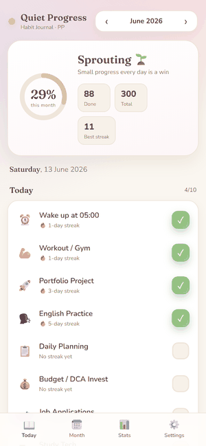
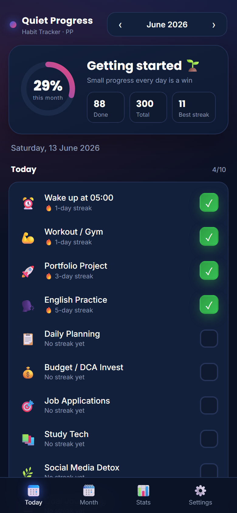
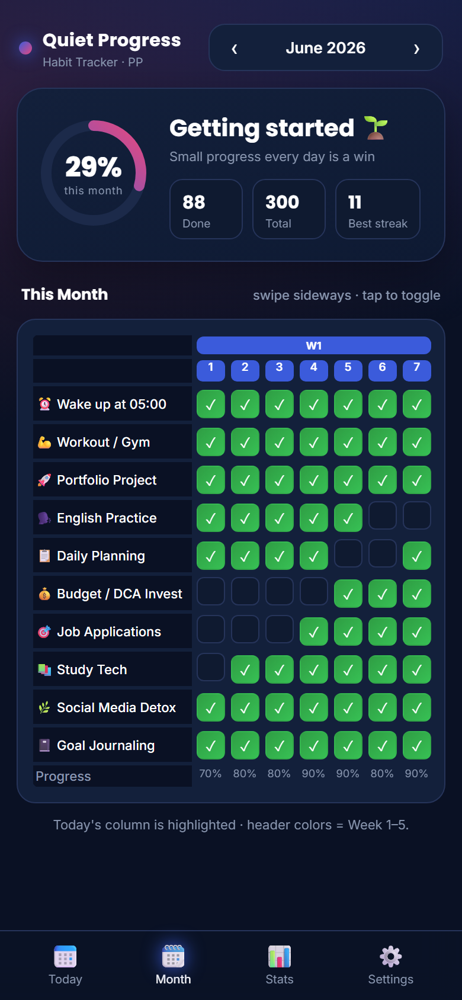
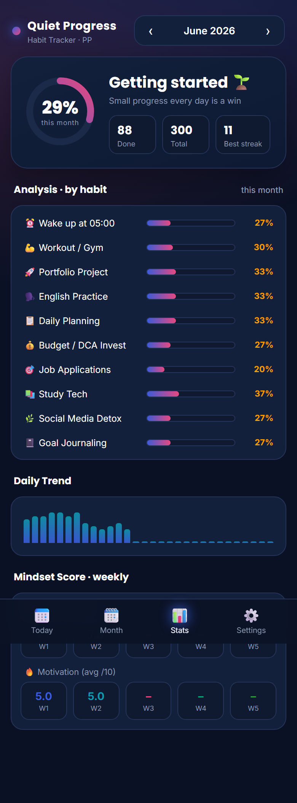

<div align="center">

# 🌙 Quiet Progress · Habit Tracker

**A clean, dark-themed habit & mindset tracker — installable PWA, fully offline, no login.**
Build better days, one tick at a time.

[**▶ Live demo**](https://paareepp.github.io/quiet-progress-tracker/) · [Install it](#-install-as-an-app)


<br/>



</div>

## 📸 Screens

<div align="center">
<table>
<tr>
<td align="center"><br/><sub><b>Today</b> · tap to check, mood & motivation</sub></td>
<td align="center"><br/><sub><b>Month</b> · color-coded weekly grid</sub></td>
<td align="center"><br/><sub><b>Stats</b> · analysis, trend & mindset score</sub></td>
</tr>
</table>
</div>

## ✨ Features
- **Tap-to-check habits** with auto-save (browser `localStorage`) — no account, no server
- **Monthly progress ring** + completed/total + best streak
- **Today view** — focused daily checklist with per-habit streaks
- **Month grid** — full calendar, color-coded by week, horizontally scrollable
- **Stats / Analysis** — per-habit completion bars, daily-trend sparkline
- **Mental State** — daily Mood & Motivation (1–10) → weekly Mindset Score
- **Confetti** 🎉 when every habit is done in a day
- **Installable PWA** — runs full-screen from the home screen, **works 100% offline**
- **Editable habits**, JSON export/import backup, month navigation

## 📲 Install as an app
- **Android (Chrome):** open the [live link](https://paareepp.github.io/quiet-progress-tracker/) → tap **Install app** (or menu ⋮ → *Add to Home screen*), or use the **Install** button in *Settings*.
- **iPhone (Safari):** open the link → **Share** ⬆️ → **Add to Home Screen**.

Once installed it launches like a native app and keeps working without internet.

## 🛠 Tech & how it works
| Area | Implementation |
|------|----------------|
| UI | Hand-written HTML/CSS, dark theme, mobile-first, zero frameworks |
| State | Plain JS + `localStorage` (per-month data model) |
| Progress ring | SVG circle with animated `stroke-dashoffset` |
| Offline | Service worker (`sw.js`) caching the app shell, cache-first |
| Install | Web App Manifest + `beforeinstallprompt` flow |
| Icons | Generated programmatically (Pillow) — gradient tile + checkmark |
| Hosting | Static files on GitHub Pages — no backend |

## 🚀 Run locally
```bash
# any static server works
python -m http.server 8765
# then open http://localhost:8765
```

## 📝 Build notes (devlog)
This is my **first deployed project** while moving from a logistics career into tech. I set three rules for myself:

1. **No dependencies, no build step** — just `index.html`. It forced me to understand the platform (DOM, SVG, the Cache API) instead of leaning on a framework.
2. **Offline-first** — I learned the service-worker lifecycle (`install` → `activate` → `fetch`) and a cache-first strategy so the app opens instantly with no network.
3. **Insights from data the user already enters** — the Mood/Motivation sliders feed the weekly Mindset Score, so the analytics cost the user nothing extra.

Trickiest part was the **PWA install flow** (capturing `beforeinstallprompt`, handling the iOS "Add to Home Screen" case separately) and getting the **service worker scope** right under a GitHub Pages sub-path. Next on the roadmap: a yearly consistency heatmap and a debt-payoff tracker mode.

---

<div align="center"><sub>Made with care for tracking quiet, daily progress. 🖤 · MIT License</sub></div>
